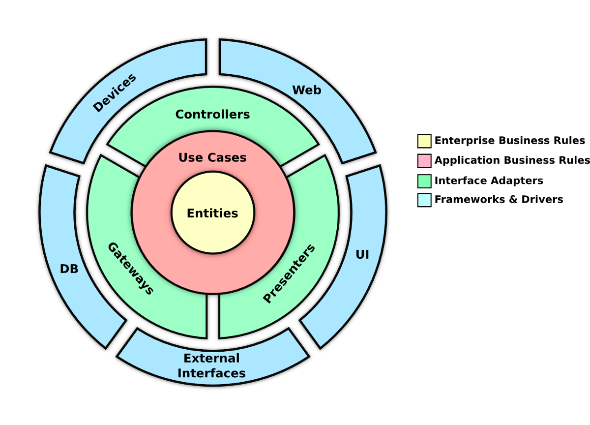

# Curso basico de flask e introducción a architecturas limpias

### Class 2
* Creación basica de app
* Handlers
* Introducción a templates
* Lectura de querystrings y parms

## Class 3
* Clean architecture
* logging
* Blueprints
* ABC

